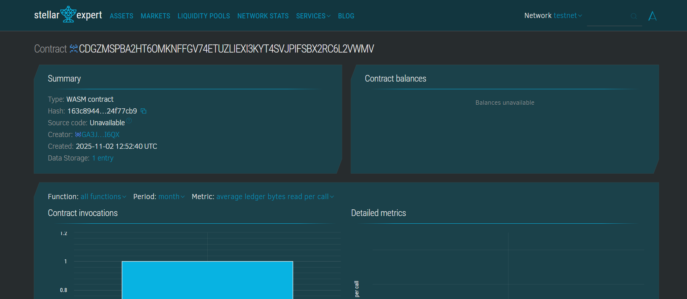

## Contract Details
Contract ID: CDGZMSPBA2HT6OMKNFFGV74ETUZLIEXI3KYT4SVJPIFSBX2RC6L2VWMV

---

**Together, let's build a safer and more transparent blood donation ecosystem!** 🩸




# Blood Donation Tracking System

## Project Title
**Blood Donation Tracking System on Stellar Blockchain**

## Project Description
The Blood Donation Tracking System is a decentralized smart contract built on the Stellar blockchain using Soroban SDK. This system provides end-to-end tracking of blood donations from donor to recipient, ensuring transparency, proper handling, storage condition monitoring, and contamination prevention. By leveraging blockchain technology, the system creates an immutable record of each donation's journey, maintaining data integrity and building trust among all stakeholders in the blood donation ecosystem.

The smart contract automatically monitors storage conditions, flags contaminated units, and manages the transfer process to ensure only safe blood reaches recipients.

## Project Vision
Our vision is to revolutionize the blood donation and transfusion ecosystem by creating a transparent, secure, and efficient tracking system that:

- **Saves Lives**: Ensures that only properly stored and uncontaminated blood reaches recipients
- **Builds Trust**: Creates an immutable, transparent record of every donation's journey
- **Improves Efficiency**: Streamlines the blood donation process from registration to delivery
- **Enhances Safety**: Automatically monitors storage conditions and prevents contaminated blood from being used
- **Empowers Stakeholders**: Provides real-time visibility to donors, healthcare providers, and recipients
- **Reduces Waste**: Helps blood banks manage inventory more effectively by tracking storage conditions

By bridging the gap between donors and recipients through blockchain technology, we aim to create a more reliable and trustworthy blood donation system that ultimately saves more lives.

## Key Features

### 1. **Donation Registration**
- Register new blood donations with complete donor information
- Automatic timestamp recording for donation time
- Blood type classification (A+, A-, B+, B-, AB+, AB-, O+, O-)
- Initial storage temperature recording
- Unique donation ID generation for tracking

### 2. **Storage Condition Monitoring**
- Real-time temperature tracking for blood units
- Automatic contamination detection (safe range: 2°C to 6°C)
- Immediate flagging of units stored outside safe temperature range
- Prevents usage of contaminated blood units
- Historical temperature data for audit purposes

### 3. **Recipient Transfer Management**
- Secure transfer of blood units to verified recipients
- Authorization verification before transfer
- Prevention of contaminated blood delivery
- Immutable delivery records
- One-time delivery enforcement (prevents duplicate usage)

### 4. **Comprehensive Statistics & Reporting**
- Total donations tracked
- Active donations in inventory
- Successfully delivered donations
- Contaminated donations count
- Real-time dashboard data for blood banks

### 5. **Blockchain Security**
- Immutable donation records
- Cryptographic verification of all transactions
- Tamper-proof storage condition logs
- Decentralized data storage
- Address-based authentication

## Future Scope

### Short-term Enhancements (3-6 months)
- **Emergency Priority System**: Flag urgent blood requirements and prioritize matching donations
- **Blood Type Matching Algorithm**: Automatic compatibility checking between donors and recipients
- **Expiration Management**: Track blood unit shelf life and send expiration alerts
- **Multi-location Support**: Track blood movement across different hospitals and blood banks
- **Mobile App Integration**: User-friendly interface for donors and recipients

### Medium-term Development (6-12 months)
- **IoT Integration**: Connect with IoT sensors for automated temperature monitoring
- **AI-Powered Predictions**: Forecast blood demand based on historical data
- **Donor Incentive Program**: Blockchain-based reward system for regular donors
- **Cross-border Tracking**: Enable international blood donation tracking
- **Medical History Integration**: Link with electronic health records (with privacy controls)
- **Quality Metrics**: Track and analyze blood unit quality parameters beyond temperature

### Long-term Vision (1-2 years)
- **Inter-chain Compatibility**: Connect with other blockchain healthcare systems
- **Plasma and Platelet Tracking**: Expand beyond whole blood to other blood components
- **DNA Matching**: Advanced genetic compatibility verification
- **Automated Compliance**: Regulatory reporting and compliance automation
- **Research Data Sharing**: Anonymous data sharing for medical research (with consent)
- **Disaster Response System**: Emergency blood supply coordination during crises
- **Global Blood Bank Network**: Connect blood banks worldwide for critical shortages

### Technical Improvements
- **Advanced Analytics Dashboard**: Comprehensive data visualization and insights
- **Multi-signature Authorization**: Enhanced security for critical operations
- **Scalability Optimization**: Handle millions of donations efficiently
- **Off-chain Storage Integration**: IPFS integration for detailed medical reports
- **Oracle Integration**: Real-time data feeds from medical equipment
- **Zero-knowledge Proofs**: Enhanced privacy while maintaining transparency

---

## Technical Stack
- **Blockchain**: Stellar Network
- **Smart Contract Language**: Rust
- **Framework**: Soroban SDK
- **Storage**: On-chain persistent storage

## Getting Started

### Prerequisites
- Rust toolchain
- Soroban CLI
- Stellar account

### Installation
```bash
# Clone the repository
git clone <repository-url>

# Build the contract
soroban contract build

# Deploy to testnet
soroban contract deploy \
  --wasm target/wasm32-unknown-unknown/release/blood_donation.wasm \
  --source <your-secret-key> \
  --network testnet
```

## Contributing
We welcome contributions from the community! Please read our contributing guidelines before submitting pull requests.
